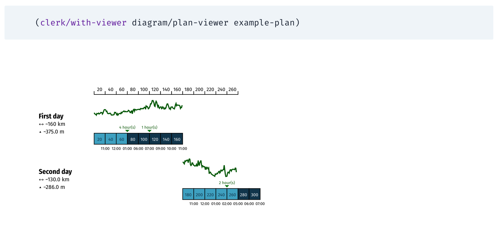
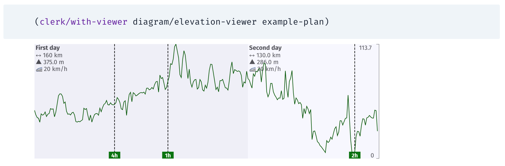

# Clerk viewers and utils to plan bikepacking events

This repository contains extensions and custom viewers for Clojure's
[Clerk](https://github.com/nextjournal/clerk), designed to help bike
tourists and ultra-cyclists to plan multi-day routes.

Traditional tools ([Komoot](https://komoot.com/),
[Strava](https://www.strava.com/),
[Cycle.travel](https://cycle.travel/), and so on…) focus on planning
the route itself, in some cases (Komoot) providing extra tools to
divide the route into multiple same-length days.

`rando-planner` assumes the user already have a GPX track defined
(provided for example by the organizers of a bike event), and let the
user plan the daily effort to a higher granularity.

After a data structure called _plan_ is defined, `rando-planner`
provides different types of visualization that can be used to study
different strategies to cover the distance.

The visualizations include:

- A map visualization (based on Leaflet) of the route, with markers
  corresponding to the location reached after each day is completed.
- A schematic diagram of the plan, showing the running count of
  kilometers, the corresponding elevation reached at each moment, when
  scheduled pauses will happen, when the Sun rises and sets (_WIP_),
  and the total amount of kilometers accumulated every day

## Usage

Add `rando-planner` as a dependency in your project. For example:

```
{:paths ["src"]
 :deps {org.clojure/clojure {:mvn/version "1.10.3"}
        rando-planner/rando-planner {:git/url "https://github.com/larsen/rando-planner.git"
                                     :git/tag "tagname"
                                     :git/sha "xxxxxxxx"}}}
```

Then, in a `src/user.clj` file:

```clojure
(ns user)

(require '[nextjournal.clerk :as clerk])

(clerk/serve! {:watch-paths ["notebooks" "src"]})
```

When jacking-in the project a HTTP server should start, answering on
port 7777. At this point you can start editing notebooks (I typically
use the directory `notebooks` to store them) using the facilities
provided by rando-planner.

### Defining a plan

```clojure
(def example-plan
  {:gpx "gpx/be-rostock.gpx"
   :daily-plans [{:date "2024-04-01"
                  :label "First day"
                  :average-speed 20
                  :color "red"
                  :activities [{:start "10:00" :type :ride :length 3}
                               {:start "17:00" :type :ride :length 2}
                               {:start "20:00" :type :ride :length 3}]}
                 {:date "2024-04-02"
                  :label "Second day"
                  :average-speed 18
                  :activities [{:start "10:00" :type :ride :length 4}
                               {:start "16:00" :type :ride :length 2.5}]}]})
 ```

### Usage examples

The screenshots below were automatically generated using
`example-plan`, as defined above.





